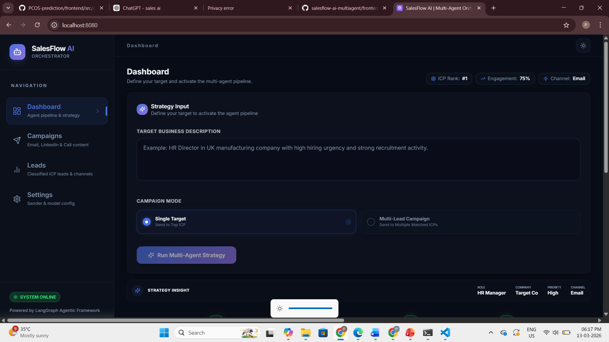
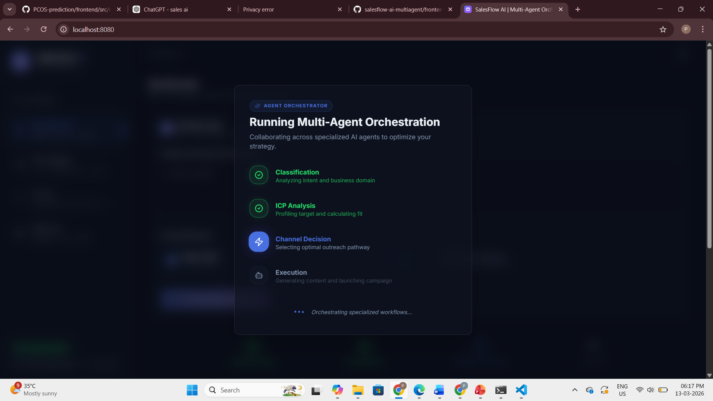
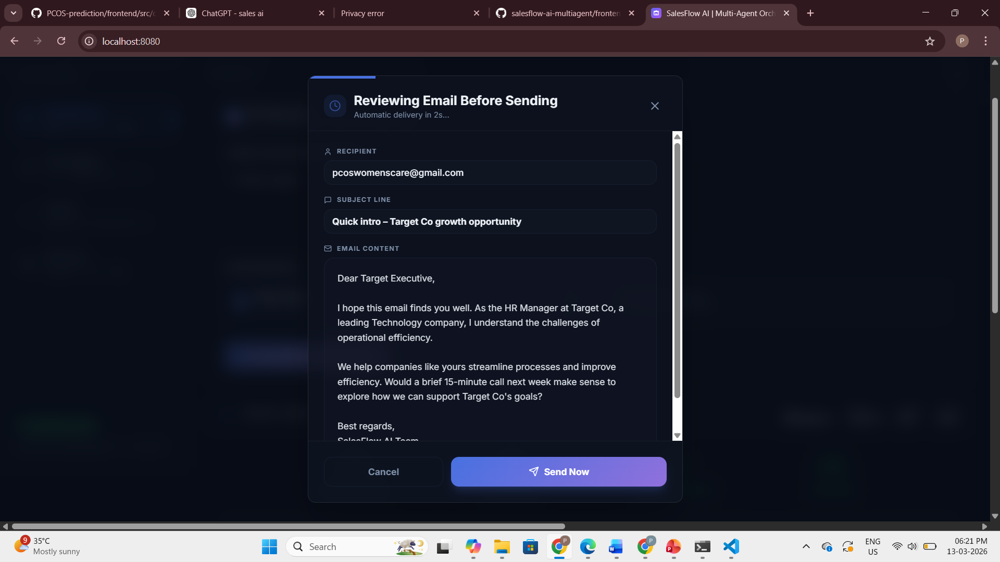
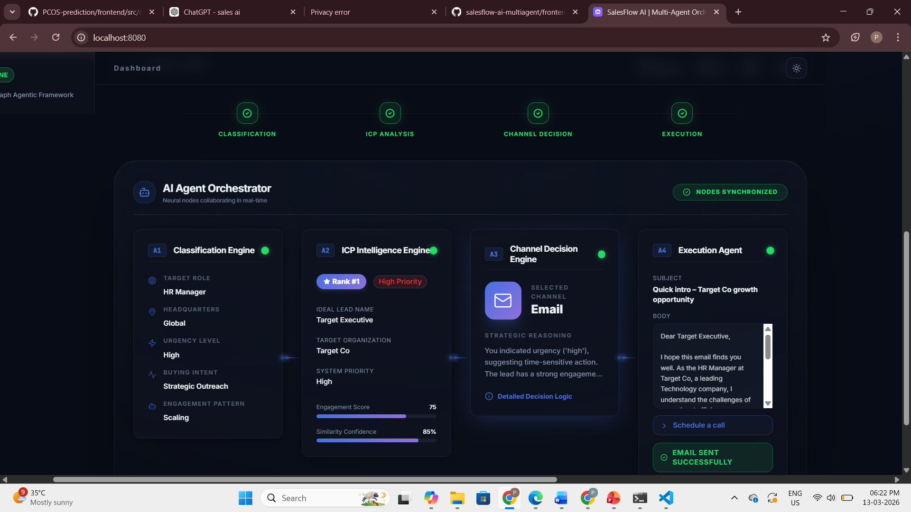
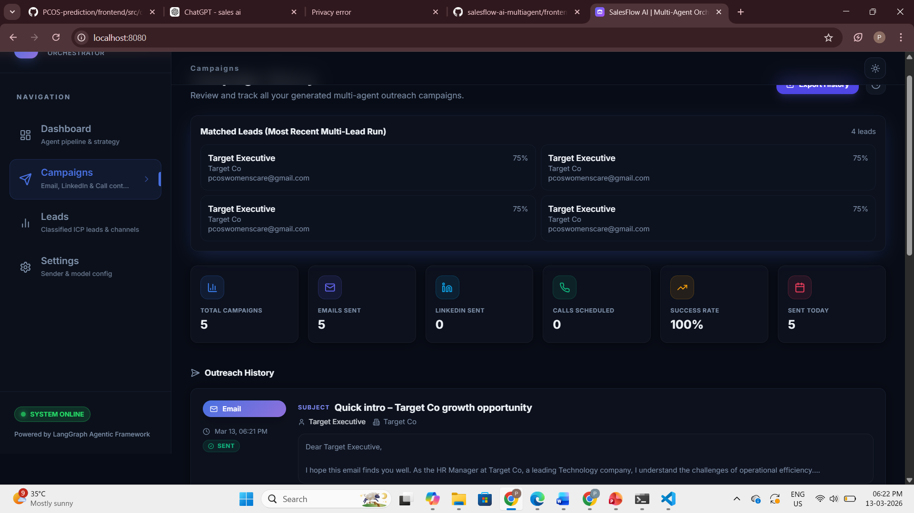
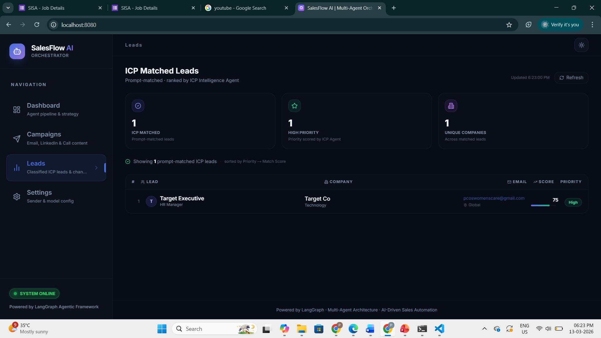
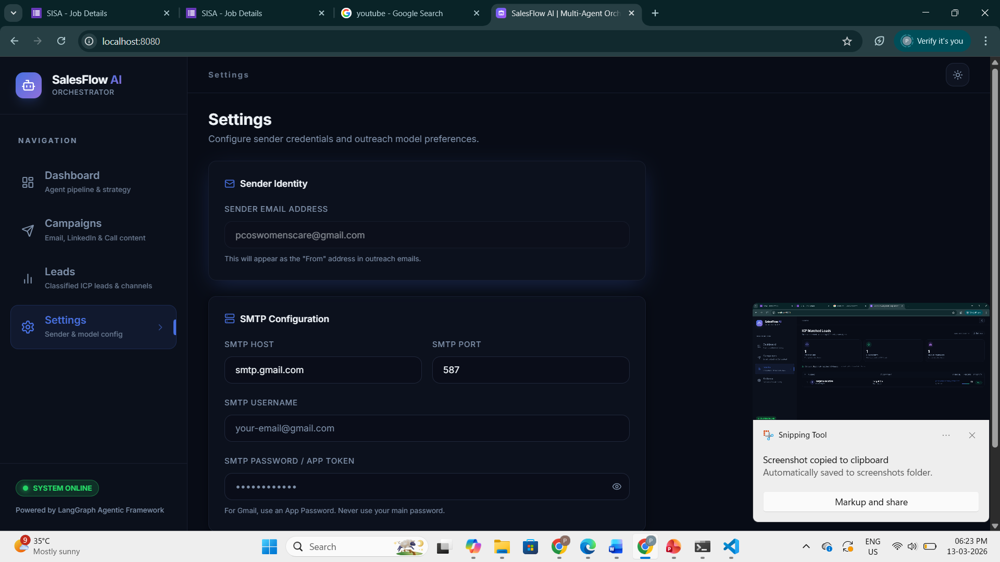

# 🚀 SalesFlow AI – Multi-Agent Sales Outreach Automation

SalesFlow AI is an **AI-powered multi-agent orchestration system** designed to automate B2B sales outreach workflows.

The system analyzes a target business strategy, identifies potential leads, selects the optimal outreach channel *(Email, LinkedIn, or Call)*, and generates personalized communication automatically using AI agents.

This project demonstrates how multiple AI agents collaborate through a structured workflow to perform complex **business automation tasks**.

---

# ⚙️ Running the Project

## 1️⃣ Start Ollama (LLM Runtime)

Make sure Ollama is installed and the model is available.

Check installed models:

```
ollama list
```

Pull the model if needed:

```
ollama pull phi3
```

---

## 2️⃣ Start Backend

Navigate to backend folder:

```
cd multiagents/backend
```

Run the backend:

```
python main.py
```

Backend will start at:

```
http://127.0.0.1:8000
```

---

## 3️⃣ Start Frontend

Open another terminal:

```
cd multiagents/frontend
```

Install dependencies:

```
npm install
```

Run the frontend:

```
npm run dev
```

---

## 4️⃣ Open Application

Open in browser:

```
http://localhost:8080
```

---

# 📸 Application Screenshots

### Dashboard – Strategy Input



### Multi-Agent Pipeline Visualization



### Email Preview Before Sending



### AI Agent Orchestration



### Campaign Analytics



### ICP Matched Leads



### SMTP Settings Configuration


